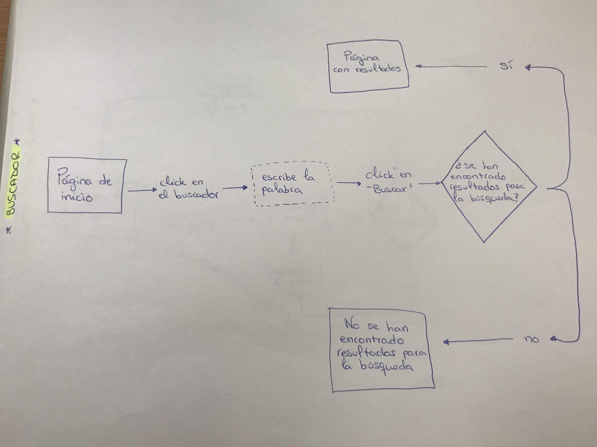
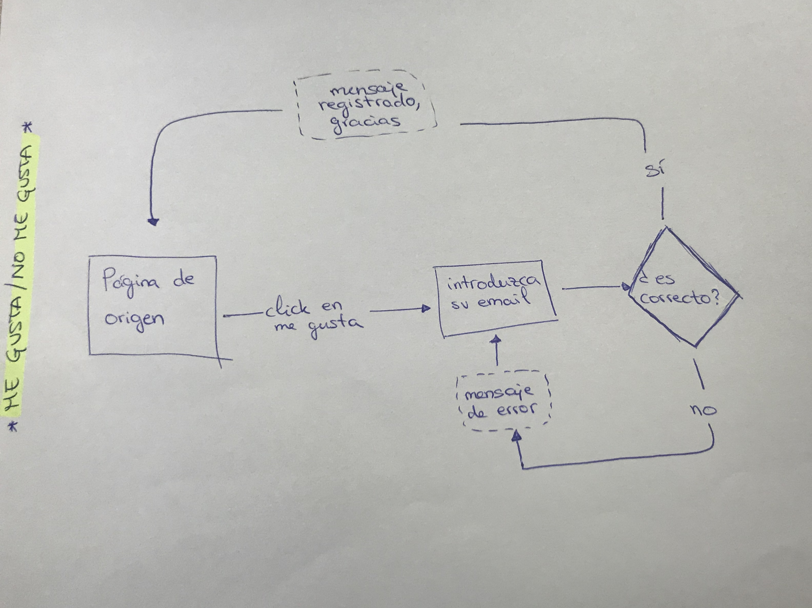
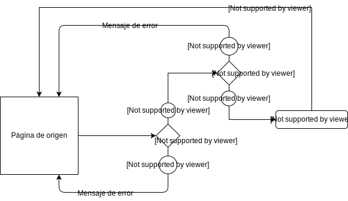

# Flujos de tareas

Tras la realización de un canvas, un mapa del sitio y una encuesta en la que se han obtenido resultados acerca de los métodos de divulgación del público objetivo se ha elaborado el diagrama del flujo de tareas con el objetivo de mostrar y comprender cuales son los pasos que el usuario debe dar para llevar a cabo una acción. 
El task flow expone de manera gráfica o simbólica el proceso de una tarea y permite comprender cuál es su recorrido y diagnosticar los errores que puedan surgir. 

El procedimiento ha sido el siguiente: 
Se ha elaborado un croquis en el que a través de flechas, rombos, cuadrados y círculos se ha explicado el proceso que los usuarios han de seguir para llevar a cabo sus tareas. Estas formas geométricas indican los pasos que sigue el usuario, el lugar en el que se encuentra y las decisiones que este ha de tomar. Igualmente, el proceso explica lo que ocurriría en caso de que el cibernauta no consiguiera llegar hasta el objetivo deseado. 
-	El rombo simboliza la toma de decisión. Se trata de un punto de inflexión en el que se abren dos nuevos caminos con las respuestas “sí” y “no”.
-	El círculo se utiliza como conector entre las flechas y las acciones y en ellos se muestran las opciones del usuario. 
-	Las flechas se utilizan como conectores y en ellas se muestran los mensajes que le aparecen al usuario en función de la acción que realice. 
-	El cuadrado (con rayas intermitentes) significa la realización de una actividad o procedimiento. 
-	El rectángulo muestra la página en la que se encuentra el usuario. 

En un principio se optó por ampliar el uso del contenido expuesto en nuestro sitio web y abarcar la posibilidad de compartirlo a través de las redes sociales. Sin embargo, tras los resultados de la encuesta realizada a una muestra de 21 personas de nuestro público objetivo, se comprobó que la mayoría no compartían asuntos políticos en sus perfiles, de modo que se optó por delimitar la interactividad a las siguientes tres acciones: buscador, me gusta / no me gusta y comentarios. Estas tareas y los movimientos correspondientes de las mismas están explicadas a continuación: 

<!--
Subid vuestro diagrama de flujo de tareas en formato de imagen 
en esta misma carpeta y enlazadlo en este documento, así:

-->

##  Buscador

El task flow del buscador comienza por la página de inicio y, al hacer click en el buscador, ubicado en la parte superior derecha de la misma, el usuario podrá escribir una o varias palabras y, directamente, clickar en el botón de *Buscar*. Una vez se haya clickado en el botón, en caso de que se hayan encontrado los resultados, aparecerá una página con ellos y, de no existir resultados para esa búsqueda, aparecera un mensaje en el que se podrá leer *No se han encontrado resultados para la búsqueda*.

## Me gusta y no me gusta

En este flujo de tareas, partiendo de la página de origen, se podrá clickar en el emoticono de *Me gusta*. En ese caso, te pedirá que introduzcas tu email. En caso de que el email sea correcto, tu me gusta quedará registrado y aparecerá un mensaje dando las gracias, antes de volver a llevarte a la página de origen. Si el email no es correcto, saldrá un mensaje de error que te conducirá de nuevo a la página que te pide el email.

## Comentarios

El task flow de los comentarios comienza por la página de origen. Para poder comentar, te pedirá introducir tu email. Si es correcto, te permitirá escribir un comentario. Si finalmente lo escribes, deberás pulsar el botón de *Enter*, que te dará las gracias y te conducirá a la página de origen. En el caso no escribir ningún comentario tras haber introducido el email, aparecerá un mensaje de error que te llevará a la página de origen.

Por otro lado, si al escribir el email hay algún dato incorrecto, te saldrá un mensaje de error que te conducirá a la página de origen.

