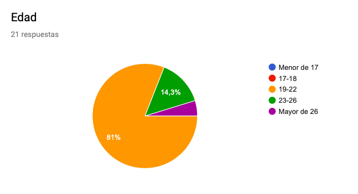
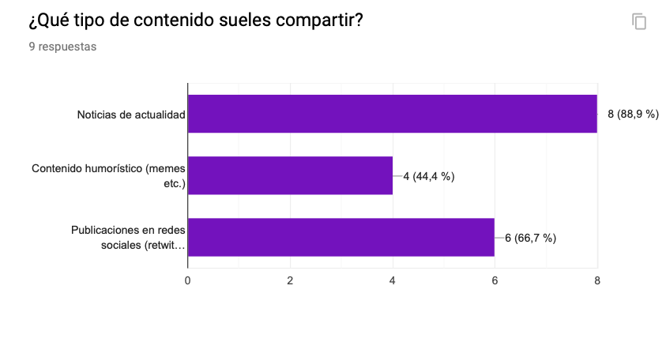
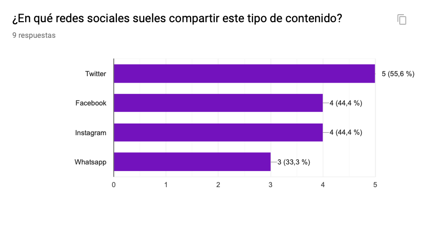
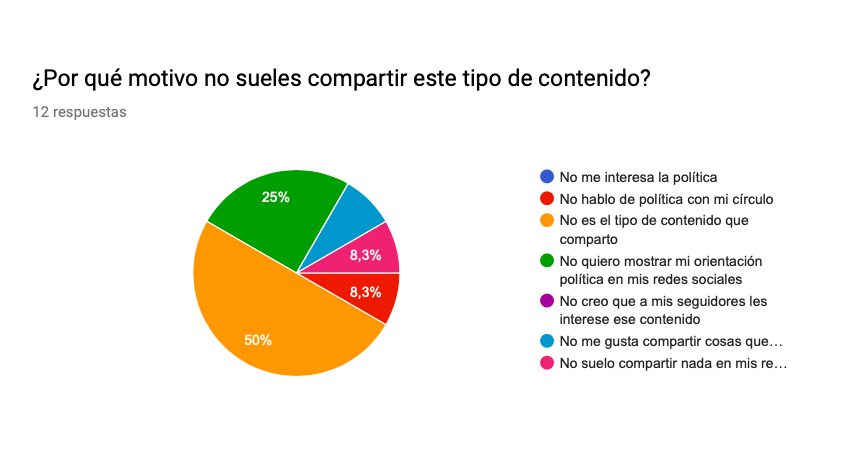
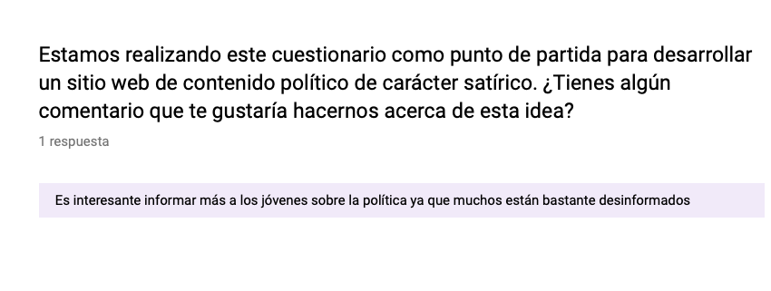

# Investigación de usuarios #

El objetivo de esta encuesta ha sido obtener información sobre el comportamiento de los usuarios de redes sociales respecto a contenido político.

**Análisis**

Para ello, se ha elaborado un cuestionario a través de Formularios de Google en el que se han recogido un total de 9 preguntas relacionadas con el contenido sobre política en redes sociales. La difusiòn se ha realizado a través de WhatsApp a amigos y conocidos de entre 19 y 26 años. Hemos logrado obtener 21 respuestas y, de entre los participantes, un 81% tenían entre 19 y 22 años, mientras que tan solo un 14,3% tenían entre 23 y 26 años.

Ninguna persona encuestada de entre 23 y 26 años comparte contenido político en las redes sociales. Sin embargo, en las edades comprendidas entre 19 y 22 años, un 42,9% afirma haberlo hecho, mientras que una mayoría del 57,1% admite no haber disfundido este tipo de contenido.

De todos los encuestados, un 88,9% comparte noticias de actualidad. Un 66,7% redistribuye publicaciones en redes y un 44,4% difunde memes sobre política.

Respecto a las redes, la mayoría de los encuestados (55,6%) prefiere Twitter. Con Facebook e Instagram, que comparten el mismo lugar (ambos 44,4%), en el último puesto se encontraría WhatsApp (33,3%).

Una de las mayores razones por las que los encuestados no comparten es porque no es el tipo de contenido que distribuyen por las redes (50%), otros prefieren no mostrar su orientación política (25%) y algunos no hablan de política en su círculo, no comparten contenido en las redes, ni distribuyen cosas que no entienden del todo (8,3%).

Durante la última campaña política, un 66,7% de los participantes en la encuesta ha compartido la misma cantidad de contenido político en sus redes sociales de lo que suele hacer habitualmente. Un 28,6% ha compartido más contenido, frente a un 4,8%, que admiten haber distribuido menos.

Nos pareció buena idea abrir un apartado en el que se pudiesen dejar comentarios y/o sugerencias acerca del proyecto que estamos llevando a cabo y nos han hecho llegar la siguiente reflexión: "Es interesante informar más a los jóvenes sobre la política ya que muchos están bastante desinformados".

**Respuestas**

**Conclusiones**

Hemos podido observar que los jóvenes no comparten tanto contenido político como el que pensábamos previamente. En su mayoría, los que lo hacen, comparten noticias de actualidad haciéndolo, en su mayoría, vía Twitter. Por el contrario, entre los que no comparten, la razón imperante es porque, generalmente, no suelen hacerlo. Asimismo, hemos observado que este tipo de contenido se comparte de igual manera durante una campaña electoral o de manera habitual, ya sea afirmativo o negativo.

