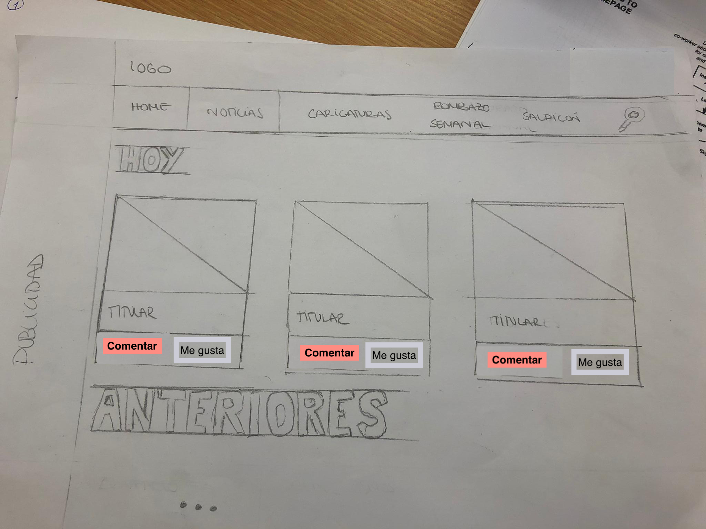
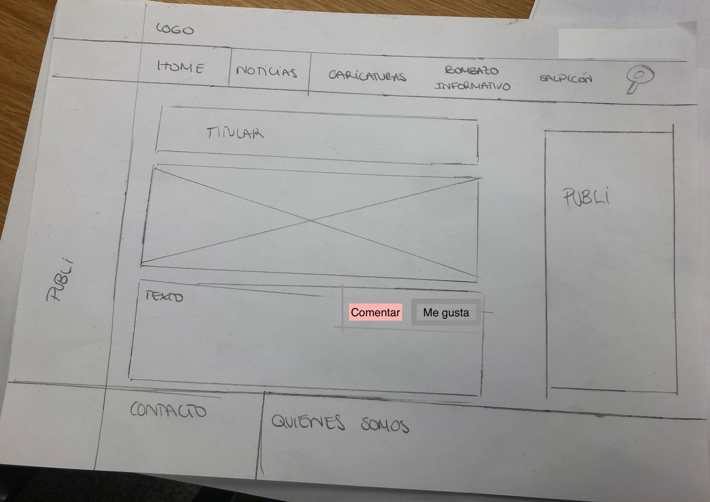
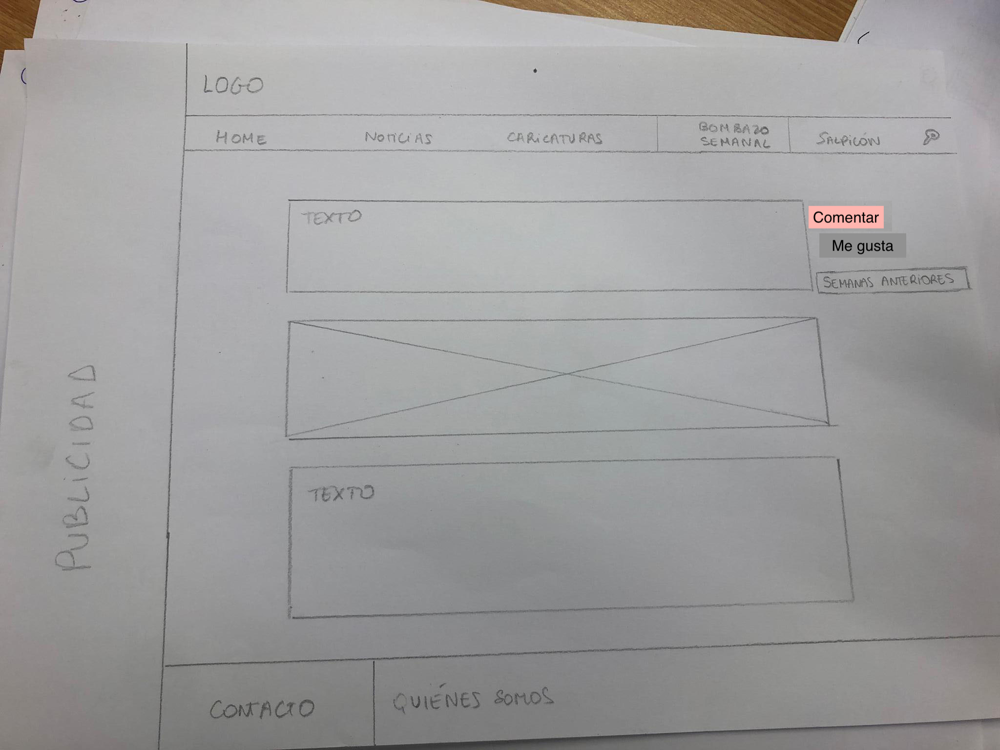

# Wireframes

<!--
Recoged en este documento un listado con enlaces a los diferentes
wireframes que creéis para el proyecto web
-->

Los wireframes constituyen los dibujos que contienen la información de cada una de las secciones que tendrá nuestra web. De esta forma, se ofrece una visión previa de lo que será nuestra pagina por dentro y cómo aparecerán ubicadas las secciones dentro de la misma, así como, cuál será la forma de acceder a cada una de ellas.

En este caso, creamos una llamada home, que contiene la previsualización de lo que será la página principal de la revista. En ella, aparecen la caricatura de la semana, tres últimas informaciones y en la barra superior las demás opciones a las que poder acceder que son las secciones de la revista. Además en todas las posibles páginas, en la parte inferior se da la opción de contacto y de quienes somos para que se pueda obtener más información acerca de quiénes hacen el contenido.

Otro wireframe es la representación de la sección noticias en las que hay dos variables, en la primera están las noticias del día junto con la opción de comentar o dar a me gusta para obtener feedback por parte del público. Mientras que en la siguiente variable hay noticias no pertenecientes al día sino noticias que se han publicado anteriormente.

Las caricaturas también contienen su wireframe en el que se refleja cómo estarán distribuidas en este caso, aparecerán todas las que se hayan hecho por orden de reciente a antigua.

Seguido, el bombazo semanal se ve en el wireframe como la organización de las que son las informaciones más relevantes y las que han publicado antes en otras publicaciones.

El último wireframe es el apartado de salpicón que tiene tres informaciones por semana y la opción de dar a me gusta y comentar para que interactúen con el contenido creado.

También se ha creado uno con la opción de buscador, que es una lupa en la que se mete lo que cada uno quiera buscar y se obtienen diferentes informaciones.

## Página principal

## Noticias

## Caricaturas

## Bombazo semanal

## Salpicón 

## Búsqueda

## Contacto

## Nosotras

