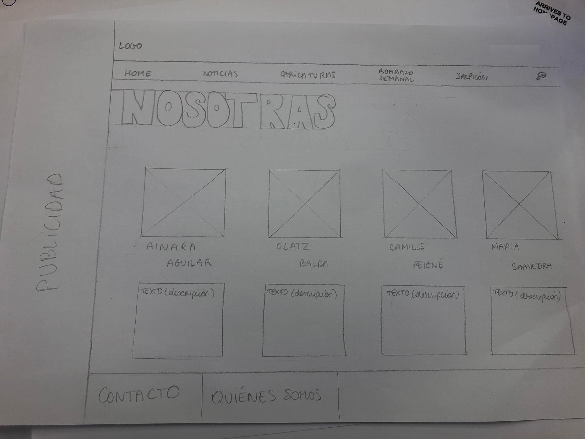
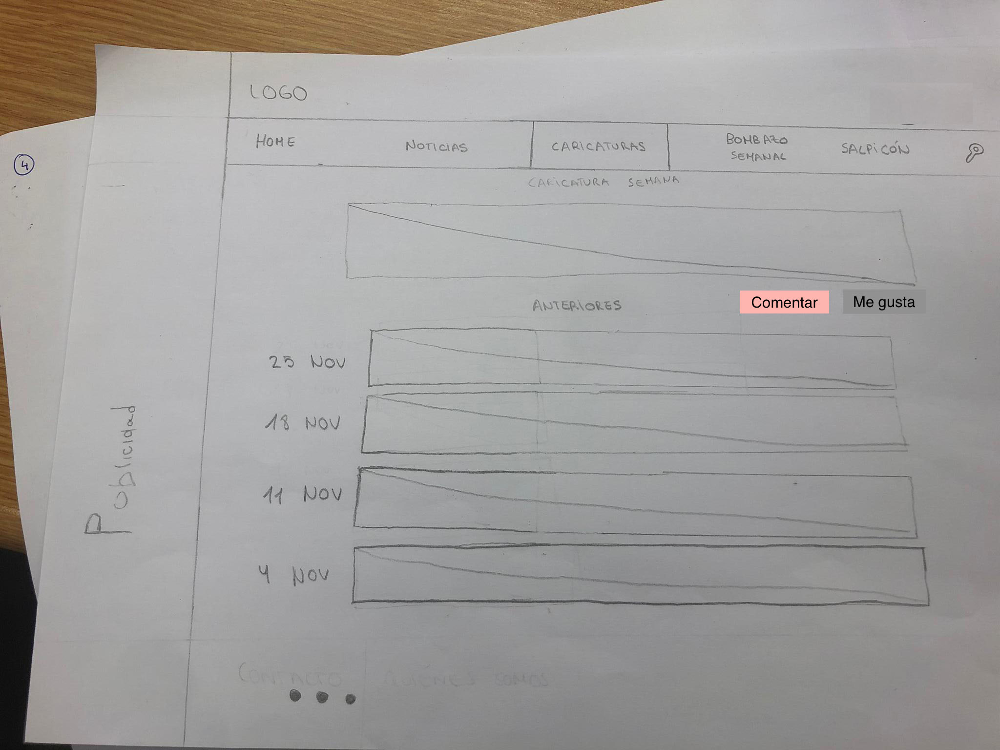
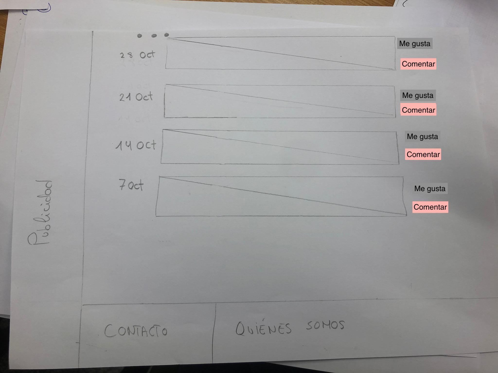

# Wireframes

<<<<<<< HEAD

=======
<!--
Recoged en este documento un listado con enlaces a los diferentes
wireframes que creéis para el proyecto web
-->

## Página principal

## Noticias

## Caricaturas

## Bombazo semanal

## Búsqueda

## Contacto

## Nosotras

>>>>>>> wireframes
